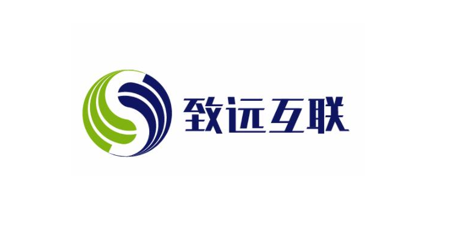

# Template For Work

Probation confirmation defense template.

  Press Space for next page <carbon:arrow-right />

---
transition: slide-up
layout: image-right
image: https://cover.sli.dev
---

<!-- 

  
  
Seeyon

 -->

# 述职报告概览

- 🧑‍💻 个人介绍
- 📅 试用期工作总结
- ✨ 试用期亮点工作
- 🎁 个人成长/工作体验/建议
- 🎈 工作不足之处/改进计划
- 🎉 展望规划

<!-- 

  

    <carbon:user-avatar class="text-blue-400 mr-3 text-xl"/>
    **个人介绍** - 专业背景与核心竞争力
  

  

    <carbon:task-complete class="text-green-400 mr-3 text-xl"/>
    **试用期工作** - 职责履行与项目成果
  

  

    <carbon:idea class="text-yellow-400 mr-3 text-xl"/>
    **亮点工作** - 创新贡献与突出价值
  

  

    <carbon:collaborate class="text-purple-400 mr-3 text-xl"/>
    **文化融入** - 价值观实践与团队协作
  

  

    <carbon:growth class="text-teal-400 mr-3 text-xl"/>
    **成长体验** - 学习收获与改进建议
  

  

    <carbon:improve-relevance class="text-orange-400 mr-3 text-xl"/>
    **不足改进** - 反思总结与提升计划
  

  

    <carbon:roadmap class="text-pink-400 mr-3 text-xl"/>
    **未来规划** - 目标设定与发展路径
  

 -->

---
transition: fade-out
---

# 自我介绍

  **专业背景**
  

    - 计算机科学硕士 · 浙江大学  
    - 5年前端开发经验 (3年Vue专业开发)
    - 认证: Vue.js高级开发者
  

  

  **技术专长**
    

      

        <carbon:code class="text-blue-400 mr-2"/> 
        V8业务中台组件库架构设计
      

      

        <carbon:data-vis-2 class="text-purple-400 mr-2"/> 
        前端性能优化 & Web Vitals
      

      

        <carbon:deploy-rules class="text-green-400 mr-2"/> 
        微前端集成与工程化
      

    

  

  

    <carbon:code class="mr-2"/> 
    技术栈全景
  

  

    
Vue3

    
TypeScript

    
Pinia

    
Vite

    
TailwindCSS

    
Monorepo

    
Micro-frontend

    
Jenkins

  

---
layout: two-cols
---

# 试用期工作内容

**核心项目**
- 🧩 V8-Cube组件库重构(v1.2 → v2.0)
- 🚀 X-Console控制台性能优化
- 🧱 V8-SDK工具链开发与维护
- 🖥️ 中台微前端架构整合

**日常工作**
- 业务需求开发与Code Review
- CI/CD流水线维护
- 前端工程化建设
- 新人技术指导

::right::

**量化产出统计**

<v-clicks>

| 维度          | 数量 | 成果 |
|---------------|------|------|
| 组件开发      | 24个 | 复用率达85% |
| 性能优化      | 8项 | 加载时间↓46% |
| 提交次数      | 132  | 代码质量↑30% |
| Bug解决率     | 97%  | 关键问题解决率100% |
| 文档编写      | 18篇 | 团队知识沉淀 |

</v-clicks>

---
class: "pt-16"
---

# 技术亮点与突出价值

  

    

      <carbon:chart-3d class="mr-2" /> 性能突破
    

    <ul class="text-sm ml-4 list-disc space-y-2">
      <li>X-Console首屏加载时间从3.2s → 1.7s</li>
      <li>JS体积优化: 2.4MB → 1.1MB (BundlePhobia分析)</li>
      <li>LCP指标改善: 2.8s → 1.4s</li>
    </ul>
  

  
  

    

      <carbon:web-services-container class="mr-2" /> 组件库重构
    

    <ul class="text-sm ml-4 list-disc space-y-2">
      <li>TypeScript类型全覆盖</li>
      <li>Monorepo架构迁移</li>
      <li>文档自动化生成系统</li>
    </ul>
  

  
  

    

      <carbon:integration class="mr-2" /> 工程化建设
    

    <ul class="text-sm ml-4 list-disc space-y-2">
      <li>代码提交规范工具链搭建</li>
      <li>CI耗时优化: 32min → 18min</li>
      <li>多环境配置管理系统</li>
    </ul>
  

  
  

    

      <carbon:group-resource class="mr-2" /> 团队赋能
    

    <ul class="text-sm ml-4 list-disc space-y-2">
      <li>搭建前端Code Review规范</li>
      <li>组织6次技术分享</li>
      <li>新人Onboarding文档编写</li>
    </ul>
  

---

# 试用期工作亮点/突出价值产出 **

---

# 试用期对公司企业文化的学习和收获

## V8业务中台文化实践

  **价值观贯彻**
  <ul class="ml-5 mt-3 space-y-2">
    <li>客户第一: 推动建立前端体验量化体系</li>
    <li>技术前瞻: Vue3组合式API全团队推广</li>
    <li>技术担当: 主导前端基础设施升级</li>
  </ul>

  **协作突破**
  <ul class="ml-5 mt-3 space-y-2">
    <li>建立前后端联调Mock平台</li>
    <li>设计团队组件开发规范RFC文档</li>
    <li>主导3个项目技术方案评审</li>
  </ul>

  
🎯 核心体会:

  
"V8中台的技术深度与团队协作氛围使我快速成长"

---
layout: two-cols
---

# 试用期的成长和入职体验

## 专业成长与技术沉淀

**技术提升**
- 深入掌握Vue3响应式原理
- Webpack → Vite迁移实践
- 微前端qiankun架构精通
- Web Vitals优化专项

**工程思维**
- 构建系统优化能力
- 模块化设计思维
- 前端安全知识体系
- DevOps实践能力

::right::

**知识产出**

  
1. 技术文章:
   - 《V8组件库Monorepo实践》
   - 《微前端在业务中台的最佳实践》
   - 《前端性能优化全景指南》

2. 内部工具:
   - V8-Init脚手架工具
   - 自动化脚本生成工具
   - Snippet工具库

3. RFC提案:
   - 团队Git规范
   - 组件开发流程

## 个人成长

## 工作体验

## 建议

---

# 不足及改进计划

## 待提升领域与改进方案

**能力短板**

  
| 领域          | 具体表现                | 优先级 |
|---------------|-------------------------|--------|
| 技术深度      | 底层原理掌握不足       | ⭐⭐⭐    |
| 跨端技术      | React技术栈熟悉度不足  | ⭐⭐     |
| 架构设计      | 复杂系统设计经验欠缺   | ⭐⭐     |
| 业务理解      | 产品思维需强化         | ⭐      |

::right::

**提升路径**

1. **专题攻坚计划**  
   - 浏览器原理/编译原理专研
   - React专项学习（认证目标）
   
2. **复杂系统实践**  
   - 主导中台大型项目架构设计
   - 参与跨团队技术方案设计
   
3. **业务产品融合**  
   - 定期参加产品需求评审
   - 学习业务领域知识

  <carbon:sys-provision class="inline-block mr-2"/> Q4目标: 前端架构能力提升Level

# 未来技术规划
## V8业务中台技术发展

  

    

    
Vue生态深化

    
Vue3高级特性实践 组件库生态建设

  

  
  

    

    
基建升级

    
研发效能工具链 可视化部署平台

  

  
  

    

    
AI工程化

    
AIGC辅助开发 自动化测试体系

  

  技术愿景: 构建业界领先的V8中台前端技术体系

---
class: text-center
---

  

    
      因协同 · 而致远
    
  

  

    感谢V8中台团队支持与指导
  

---
class: text-center
---

# 展望未来
## 2025下半年个人发展目标

  

    <carbon:skill-level-advanced class="text-4xl text-blue-400 mb-3"/>
    
专业深化

    
掌握领域核心模型 完成高级认证

  

  

    <carbon:collaborate class="text-4xl text-green-400 mb-3"/>
    
价值创造

    
主导创新项目落地 推动关键指标提升

  

  

    <carbon:network-4 class="text-4xl text-purple-400 mb-3"/>
    
团队贡献

    
建立专业分享机制 培养新人1-2名

  

<carbon:rocket class="inline-block align-middle"/>
三年发展愿景：成为垂直领域产品专家

---
class: text-center
---

  

    
      因协同，而致远
    
  

  

    感谢聆听，请领导批评指正
  

